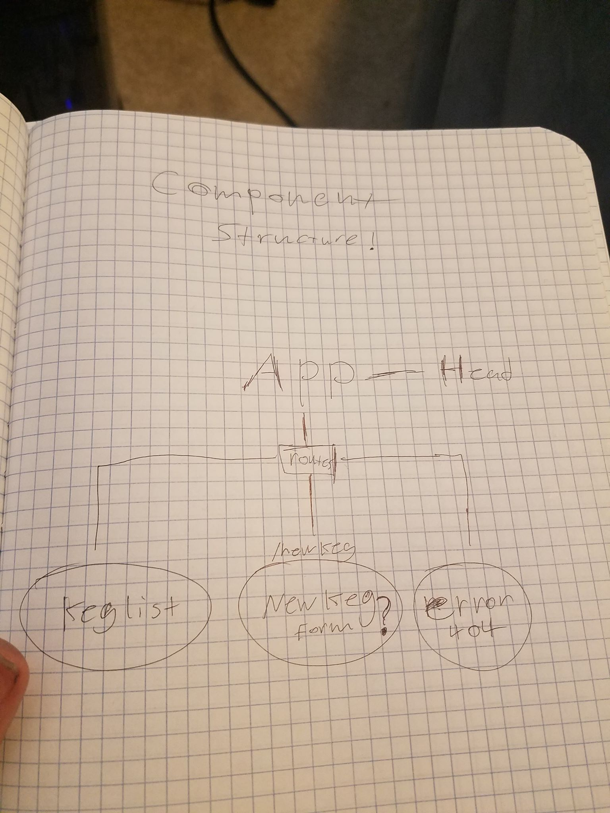

# Tap-Room-React

### By Jared Lutz

## Description
this is a clone project of a previous two-day project! It has reacts functionality and easy routing.

Notes:

NEW!!!!!
State may need to reside in App as both the kegList and newKegForm may need it.

not entirely sure how to make this project dynamic yet, I keep hitting road blocks like "how do I subtract from a specific pint without subtracting from them all? should I hard code 3 separate pint repo's? or is there a way to target them and subtract from just those."

OLD!!
setting up an environment is hard! ran into several errors trying to copy paste and remove certain components. this did not work. I'm starting the environment from scratch.

I'm noticing that the same css I used for angular will not render the same in react.
I have to tweak it a little to get it to look the same.

I've also noticed how fast it is to set up routing in react.

I wasn't quite sure how to color code my drinks just yet or add functionality so that the buttons actually sell a pint.

My original tap-toom project did not actually contain an edit form
I will at least add this to the new site to further show multiple pages.

Writing javascript, css and HTML in the same file feels really weird. but it's also really easy and I'm having fun with react.

#IMPORTANT
at the moment there is no functionality in the sell buttons and form.

## Setup and Installation requirements

### To clone project to desktop:
* Copy path from Github,
* Change directories to Desktop,
* with command line, enter "git clone + path", change directories into newly added project directory.
### To view source code on your machine:
* From the project root directory in the command line, enter "atom .",
* run npm install in the terminal
* run npm run start to view the site at localhost8080

